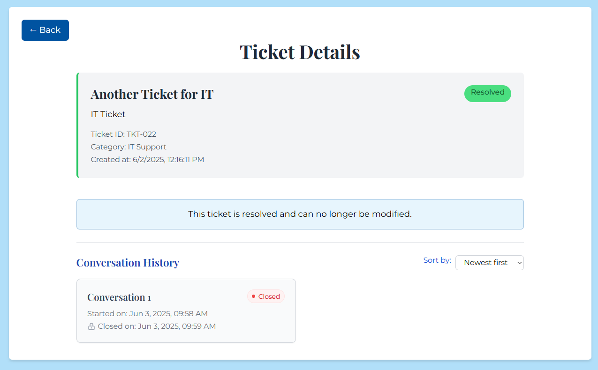

# 🏥 Bianca Aesthetic Clinic Helpdesk System

A comprehensive ticketing system designed for Bianca Aesthetic Clinic to manage customer support requests efficiently. This full-stack application provides role-based access control, real-time conversations, and an AI-powered chatbot assistant.

## 📋 Table of Contents

- [Overview](#overview)
- [Features](#features)
- [Technology Stack](#technology-stack)
- [System Architecture](#system-architecture)
- [Getting Started](#getting-started)
- [Project Structure](#project-structure)
- [User Roles & Permissions](#user-roles--permissions)
- [API Documentation](#api-documentation)
- [License](#license)

## 🌟 Overview

The Bianca Aesthetic Clinic Helpdesk System is a modern, responsive web application that streamlines customer support operations. It supports multiple user types from guests to administrators, providing a seamless experience for ticket submission, management, and resolution.

### Key Highlights

- **Guest-Friendly**: Allows ticket submission without registration
- **AI-Powered**: Google Gemini AI chatbot for automated assistance
- **Real-Time Communication**: Live conversations between customers and staff
- **Role-Based Access**: Secure, hierarchical permission system
- **Responsive Design**: Works seamlessly on desktop and mobile devices
- **Audit Trail**: Complete logging of all system activities

## ✨ Features

### 🎯 Core Features

#### For Guests & Customers
- **Ticket Submission**: Submit support requests without requiring registration
- **Account Registration**: Optional registration for enhanced features
- **Ticket Tracking**: View and manage personal tickets
- **Real-Time Chat**: Live conversations with support staff
- **Email Notifications**: Automatic updates on ticket status
- **AI Chatbot**: 24/7 automated assistance and ticket creation

#### For Staff Members
- **Ticket Queue**: Access to shared pool of unassigned tickets
- **Ticket Claiming**: Self-assign tickets from the queue (max 5 active)
- **Conversation Management**: Start and manage customer conversations
- **Ticket Resolution**: Mark tickets as resolved or cancelled
- **Internal Notes**: Add private notes visible only to staff/admin
- **Dashboard Analytics**: Personal performance metrics
- **Category Specialization**: Handle tickets in specific areas (General, Billing, IT Support)

#### For Administrators
- **Complete Oversight**: View and manage all tickets in the system
- **Staff Management**: Create, edit, and deactivate staff accounts
- **Ticket Assignment**: Manually assign tickets to specific staff members
- **System Analytics**: Comprehensive dashboard with performance metrics
- **Audit Logs**: Complete history of all system activities
- **Staff Performance**: Monitor resolution rates and workload distribution
- **Priority Management**: Update ticket priorities and categories

### 🤖 AI Chatbot Features
- **Natural Language Processing**: Powered by Google Gemini 2.0 Flash
- **Intelligent Ticket Creation**: Automatically extracts information to create tickets
- **Context Awareness**: Maintains conversation history for relevant responses
- **Multi-User Support**: Works for both guests and registered users
- **Fallback Support**: Seamlessly transitions to human support when needed

### 🔄 Ticket Lifecycle
1. **Pending**: Newly created tickets awaiting assignment
2. **In Progress**: Tickets actively being worked on by staff
3. **Resolved**: Successfully completed tickets
4. **Cancelled**: Tickets cancelled by staff or admin

### 📊 Analytics & Reporting
- **Ticket Status Distribution**: Real-time overview of system status
- **Staff Performance Metrics**: Resolution rates and workload tracking
- **Category Analysis**: Distribution of tickets by type
- **Priority Tracking**: Monitoring of high/medium/low priority tickets

## 🛠 Technology Stack

### Frontend
- **React 18.2.0**: Modern UI framework with hooks
- **React Router Dom**: Client-side routing
- **Tailwind CSS**: Utility-first CSS framework
- **Axios**: HTTP client for API communications
- **Lucide React**: Modern icon library

### Backend
- **Node.js**: Server-side JavaScript runtime
- **Express 5.1.0**: Web application framework
- **Sequelize 6.37.7**: PostgreSQL ORM
- **JWT**: JSON Web Token authentication
- **bcrypt**: Password hashing
- **Google Generative AI**: Chatbot powered by Gemini 2.0 Flash
- **Swagger**: API documentation

### Database
- **PostgreSQL**: Primary database for data persistence
- **Sequelize Migrations**: Database version control

### Additional Tools
- **Nodemailer**: Email notifications
- **Node-cron**: Scheduled tasks for ticket escalation
- **Cookie-parser**: Session management
- **CORS**: Cross-origin resource sharing
- **ESLint**: Code quality and consistency

## 🏗 System Architecture

```
┌─────────────────┐    ┌─────────────────┐    ┌─────────────────┐
│   Frontend      │    │   Backend       │    │   Database      │
│   (React)       │◄──►│   (Express)     │◄──►│   (PostgreSQL)  │
│                 │    │                 │    │                 │
│ • User Interface│    │ • REST API      │    │ • User Data     │
│ • State Mgmt    │    │ • Authentication│    │ • Ticket Data   │
│ • Routing       │    │ • Business Logic│    │ • Audit Logs    │
│ • Components    │    │ • Chatbot AI    │    │ • Conversations │
└─────────────────┘    └─────────────────┘    └─────────────────┘
                               │
                       ┌───────┴───────┐
                       │  External APIs │
                       │               │
                       │ • Google AI   │
                       │ • Email SMTP  │
                       └───────────────┘
```

## 🚀 Getting Started

### Prerequisites

- **Node.js** (v16 or higher)
- **PostgreSQL** (v12 or higher)
- **npm** or **yarn** package manager
- **Google AI API Key** (for chatbot functionality)

### Installation

1. **Clone the repository**
   ```bash
   git clone <repository-url>
   cd wads-proto
   ```

2. **Install dependencies**
   ```bash
   # Install root dependencies
   npm install

   # Install backend dependencies
   cd backend
   npm install

   # Install frontend dependencies
   cd ../frontend
   npm install
   ```

3. **Database Setup**
   ```bash
   # Create PostgreSQL database
   createdb bianca_helpdesk

   # Configure environment variables (see Environment Configuration)
   # Run database migrations
   cd backend
   npm run migrate  # If migration scripts exist
   ```

4. **Environment Configuration**
   
   Create `.env` file in the backend directory:
   ```env
   # Database Configuration
   DB_NAME=bianca_helpdesk
   DB_USER=your_postgres_user
   DB_PASS=your_postgres_password
   DB_HOST=localhost
   DB_PORT=5432
   DB_DIALECT=postgres
   DB_SSL=false

   # JWT Configuration
   ACCESS_TOKEN_SECRET=your_jwt_secret_key
   REFRESH_TOKEN_SECRET=your_refresh_token_secret

   # Google AI Configuration
   GEMINI_API_KEY=your_google_ai_api_key

   # Email Configuration (for notifications)
   EMAIL_HOST=your_smtp_host
   EMAIL_PORT=587
   EMAIL_USER=your_email_address
   EMAIL_PASS=your_email_password

   # Server Configuration
   PORT=3001
   ```

5. **Start the Development Servers**
   ```bash
   # Terminal 1: Start Backend Server
   cd backend
   npm start
   # Server runs on http://localhost:3001

   # Terminal 2: Start Frontend Development Server
   cd frontend
   npm start
   # Application runs on http://localhost:3000
   ```

6. **Access the Application**
   - **Main Application**: http://localhost:3000
   - **API Documentation**: http://localhost:3001/api-docs

## 👥 User Roles & Permissions

### 🔓 Guest Users
- Submit tickets without registration
- Receive email notifications
- Access AI chatbot for immediate assistance
- No persistent dashboard access

### 👤 Registered Customers (USR)
- All guest capabilities plus:
- Personal ticket dashboard
- Real-time conversation with staff
- Ticket history and tracking
- Edit pending tickets
- Account management

### 👨‍💼 Staff Members (STF)
- Access to ticket queue in their specialization area
- Claim tickets (maximum 5 active tickets)
- Start and manage conversations with customers
- Add internal notes to tickets
- Resolve or cancel tickets
- View personal performance metrics
- Specialization areas:
  - **General**: General inquiries and clinic questions
  - **Billing**: Payment issues and billing concerns
  - **IT Support**: Technical problems and system issues

### 👨‍💻 Administrators (ADM)
- Complete system access and oversight
- Manage all tickets regardless of category
- Create and manage staff accounts
- Manually assign tickets to staff
- View comprehensive system analytics
- Access audit logs
- Update ticket priorities and status
- Monitor staff performance
- System configuration capabilities

## 🔗 API Documentation

The API follows RESTful principles and includes comprehensive Swagger documentation.

### Base URL
```
http://localhost:3001/api
```

### Authentication
The API uses JWT (JSON Web Tokens) for authentication. Include the token in the Authorization header:
```
Authorization: Bearer <your_jwt_token>
```

### Key Endpoints

#### User Operations
- `POST /api/user/log-in` - User login
- `POST /api/user/sign-up` - User registration
- `POST /api/user/tickets` - Submit a Ticket
- `POST /api/user/forget-password` - Send reset password link to email
- `GET /api/user/verify-reset-link/:token` - Verify auth token from reset password link
- `POST /api/user/enter-new-password/:token` - Enter new password with verified token
- `PUT /api/user/tickets/:id` - Edit a ticket
- `PATCH /api/user/tickets/:id` - Cancel a ticket
- `GET /api/user/activate/:token` - Authenticate a user

#### Ticket Management
- `GET /api/ticket/categories` - Get ticket categories
- `GET /api/ticket/statuses` - Get ticket statuses
- `GET /api/ticket/priorities` - Get ticket priorities
- `GET /api/ticket/:id` - Get ticket details
- `POST /api/ticket/:id/note` - Create a note for a ticket

#### Staff Operations
- `PATCH /api/staff/tickets` Claiming a ticket
- `GET /api/staff/tickets` - Get all assigned tickets
- `GET /api/staff/summary` - Get performance summary of staff
- `PATCH /api/staff/tickets/:id/resolve` - Resolve a ticket
- `PATCH /api/staff/tickets/:id/cancel` - Cancel a ticket

#### Admin Operations
- `GET /api/admin/all-tickets` - Get all available tickets
- `GET /api/admin/staff-performance` - Staff performance metrics
- `GET /api/admin/staff` - Get staff account
- `PATCH /api/admin/tickets/:ticketId/staff` - Assign ticket to staff

#### Conversations
- `POST /api/conversation/:ticketId` - Create new conversation
- `PATCH /api/conversation/:ticketId` - Close a conversation
- `POST /api/conversation/:convoId/messages` - Send message
- `GET /api/conversation/:convoId` - Get conversation with each chat
- `GET /api/conversation/:convoId/history` - Get conversation history

#### Chatbot
- `POST /api/chatbot/message` - Send message to AI chatbot

### Complete API Documentation
Visit `http://localhost:3001/api-docs` when the server is running for interactive Swagger documentation.

## 📷 Screenshots of Working Web App
### Home Page

This home page is the landing page and where all users start. The are 2 main buttons to prompt a new ticket submission or view their own tickets.

### Submit a Ticket Page

This is the main feature where users and staff alike may submit a new ticket whether or not they are registered/logged in. It prompts an email, ticket title, category, and ticket description.

### Your Tickets Page

This is where registered users view their already sent tickets to see if a staff has updated the status or started a conversation.

### Editing a Ticket Modal

This appears when the user or staff clicks the edit ticket button. They may edit any aspect of the ticket.

### Cancelling a Ticket Modal

This modal appears as validation for the user to cancel their ticket while it is still in Pending status. This is also available for staffs when they are assigned a ticket. This will update the tickets status to Cancelled.

### Closed Conversation Page

This conversation is available for users and staffs. Only staff can create conversations and users can communicate with staff through this page. This is an example of a closed conversation that can only be done by the staff that created the conversation.

### Pending Ticket Detail

This is an example of a Pending ticket, the available components are the edit ticket and cancel ticket.

### Login Page

This login page is available for all users who would like to login with a registered account. If the user forgets their password they may navigate to the page or if they would like to sign up then they would also navigate to the appropriate page.

### Staff Queue Page

This ticket queue is available for all staff and can be seen as a second tab after the ticket management. This is the page where staff may claim more tickets that may have no been assigned automatically or manually. Staff can claim up to 5 tickets.

### Resolved Ticket Detail

This is the example of a resolved ticket where users cannot do any actions or continue conversations.

### Staff Dashboard Page

This dashboard will show the staffs assigned tickets. With the total number of tickets along with the status and another tab to naivgate to the ticket queue. Along with the full information of each ticket including ID, title, name, email, creation and update date, category, priority, status and actions. When they view a ticket it leads them to the view ticket details page where they may start a conversation, cancel the ticket, or resolve the ticket.

### Ai Chatbot Popup

This appears for staff, guests, and customers, as they are the only users that can make tickets. This will appear when clicking the AI Chatbot bubble in the corner of the screen. This AI can create tickets for the user.

### Admin Dashboard Page

This page is only accessible to registered admins. The seen components are the total number of tickets in the entire system along with the status of each ticket. A tab is available to switch from ticket management or staff management.

### Staff Management Page

This page is only available to registered admins. This page allows admins to add staff or view staff details.

### Add New Staff Modal

This popup appears when clicking the "Add Staff" button in the staff management page. This modal prompts the admin to input the email of the staff, the field of the staff, and their role.

### Ticket Management Page

This page appears as the main management for the admin dashboard. All list of tickets can be seen along with their ID, title, name of sender, email of sender, when the ticket was made and last updated, the category, priority, status, and the assigned staff. There are action buttons available for the admin to either view and peek into the ticket or assign/reassign the ticket to a new staff.

### System Audit Log

This audit log is only available to registered admins. This show all creations, deletions, and updates all accross the system. It can be filtered by date, action or user. The admin can also export all the data as a PDF document or Excel sheet.

**Built with ❤️ for Bianca Aesthetic Clinic**

*This documentation serves as a comprehensive guide for developers, administrators, and users of the Bianca Aesthetic Clinic Helpdesk System. For the most up-to-date information, please refer to the latest version of this documentation.*
