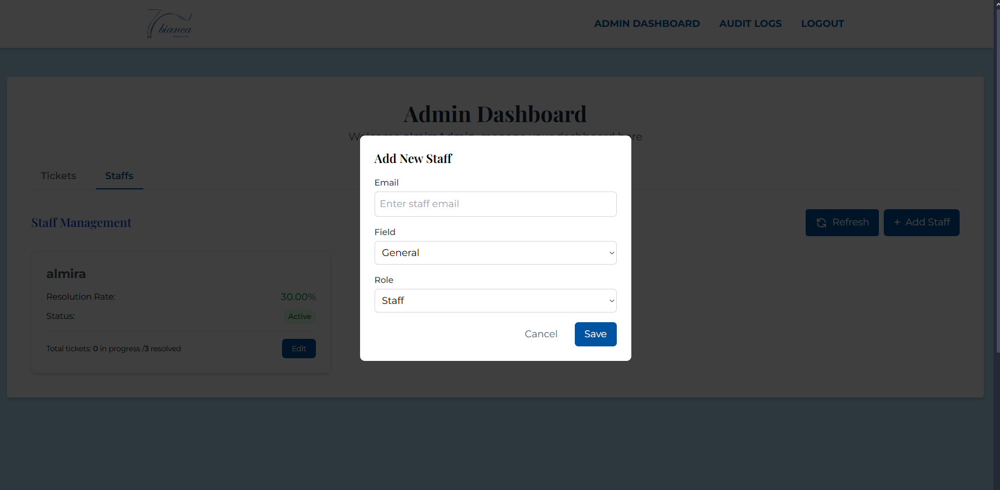
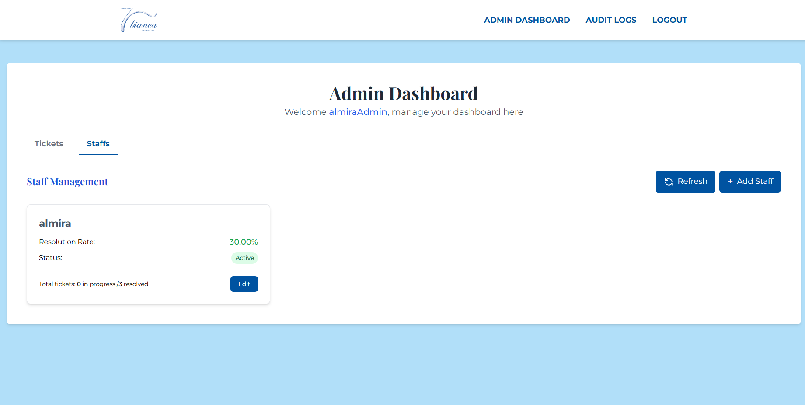

# Administrator User Guide

This guide is designed for administrators of the Bianca Helpdesk system. It covers all administrative functions and system management tasks.

## Admin Dashboard

After logging in as an administrator, you'll see the admin dashboard with comprehensive system information:

The dashboard provides:
- Ticket status summary
- Staff performance metrics
- System health indicators

## Ticket Management

As an administrator, you have complete control over all tickets in the system.

### Viewing All Tickets

You can see all tickets in the system regardless of their status or assignment:

1. Navigate to "All Tickets" in the admin menu
2. Use the filters to sort by category, status, or priority
3. Use the search function to find specific tickets by keyword

### Managing Ticket Priorities

You can change the priority level of any ticket:

1. Find the ticket you want to modify
2. Click on the priority dropdown
3. Select the new priority level (High, Medium, or Low)
4. The system will update the ticket automatically

### Assigning Tickets to Staff

You can manually assign tickets to specific staff members:

1. Find the unassigned ticket you want to assign
2. Click "Assign Staff" 
3. Select a staff member from the dropdown
4. Click "Assign"
5. The ticket will be immediately assigned to that staff member

## Staff Management

### Viewing Staff Performance

Monitor staff performance metrics:

1. Navigate to "Staff Performance" in the admin menu
2. View metrics for each staff member including:
   - Number of assigned tickets
   - Number of resolved tickets
   - Resolution rate
   - Average resolution time

### Staff Assignment Strategies

You can use different strategies for ticket assignment:

1. **Manual Assignment**: Personally assign tickets to specific staff members
2. **Round Robin**: Allow the system to automatically distribute tickets among staff members
3. **Skill-Based**: Assign tickets based on staff expertise and ticket categories

## System Monitoring

### Audit Logs

Review system activities for security monitoring and compliance:

The audit log records:
- User login/logout events
- Ticket status changes
- Staff assignments
- Administrative actions

### System Statistics

View comprehensive statistics about system usage:
- Daily/weekly/monthly ticket volumes
- Average resolution times
- Customer satisfaction ratings
- Peak usage periods

## System Configuration

### Managing Categories

You can create, edit, or deactivate ticket categories:
1. Navigate to "System Settings" > "Categories"
2. Add new categories as needed
3. Edit existing category names
4. Deactivate categories that are no longer needed

### Managing Priorities

Configure the priority levels available in the system:
1. Navigate to "System Settings" > "Priorities"
2. Define priority levels and their visual indicators
3. Set default SLA times for each priority level

## Troubleshooting

As an administrator, you may need to troubleshoot issues:

1. Check the audit logs for unusual activity
2. Review user permissions if access problems are reported
3. Check system logs for technical errors
4. Contact IT support for advanced technical issues

## Best Practices

- Regularly review staff performance metrics
- Balance workload among staff members
- Monitor ticket resolution times and address delays
- Keep ticket categories updated and relevant
- Backup system data regularly
