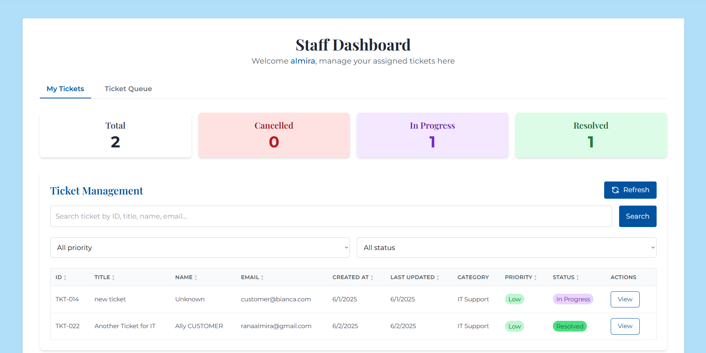
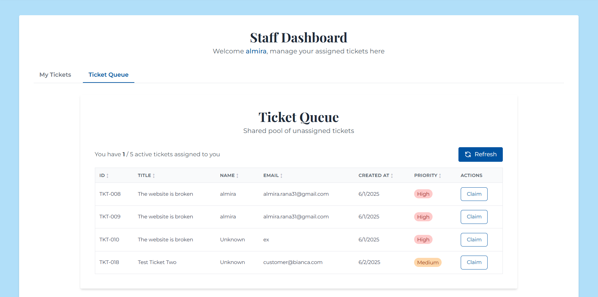
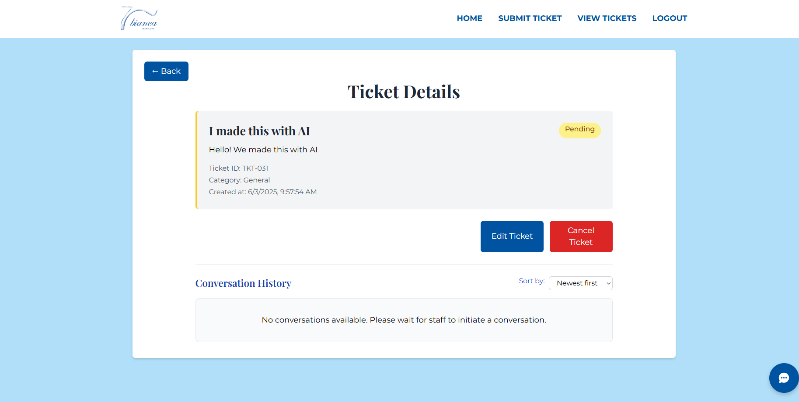
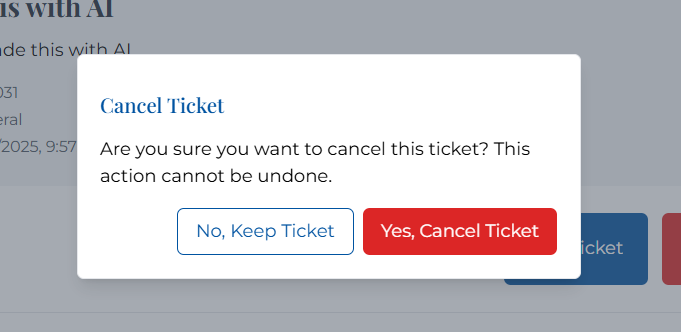

# Staff User Guide

This guide is designed for staff members using the Bianca Helpdesk system. It covers all the operations and features available to staff users.

## Dashboard Overview

When you log in as a staff member, you'll see your dashboard with important information:

The dashboard provides:
- List of assigned tickets
- Performance metrics
- Ticket status summary

## Managing Tickets

### Viewing Available Tickets

The ticket pool shows all tickets that haven't been assigned yet.

### Claiming Tickets

To claim a ticket from the pool:
1. Navigate to the ticket pool
2. Find a ticket you wish to work on
3. Click the "Claim" button
4. The ticket will be assigned to you and appear in your ticket list

### Managing Your Assigned Tickets

You can filter your assigned tickets by:
- Priority
- Status
- Keywords (using the search function)

### Viewing Ticket Details

Click on any ticket to view its details:

On this screen, you can:
- Read the full ticket description
- See the ticket history
- Access the conversation with the customer
- Resolve or cancel the ticket

## Communicating with Customers

### Starting a Conversation

To start a conversation with a customer:
1. Open the ticket details
2. Click "Start Conversation" if no conversation exists
3. If a conversation was previously closed, you can click "Reopen Conversation"

### Sending Messages

In an active conversation:
1. Type your message in the text box
2. Press "Send" or hit Enter
3. Your messages will be marked with your username

### Closing a Conversation

When an issue is resolved:
1. Click the "Close Conversation" button
2. The conversation will be archived and marked as closed
3. You can reopen it later if needed

## Resolving Tickets

When you've addressed the customer's issue:
1. Navigate to the ticket details
2. Click the "Resolve" button
3. The ticket status will change to "Resolved"
4. The ticket will remain in your history but will be marked as completed

## Cancelling Tickets

If a ticket needs to be cancelled:
1. Navigate to the ticket details
2. Click the "Cancel" button
3. The ticket status will change to "Cancelled"
4. The ticket will remain in your history but will be marked as cancelled

## Viewing Your Performance

You can view your performance metrics by clicking on "Performance" in the navigation menu.

These metrics include:
- Number of tickets assigned to you
- Number of tickets in progress
- Number of resolved tickets
- Number of cancelled tickets

## Help and Support

If you encounter any issues using the helpdesk system, please contact your administrator or refer to the troubleshooting section of this documentation.
